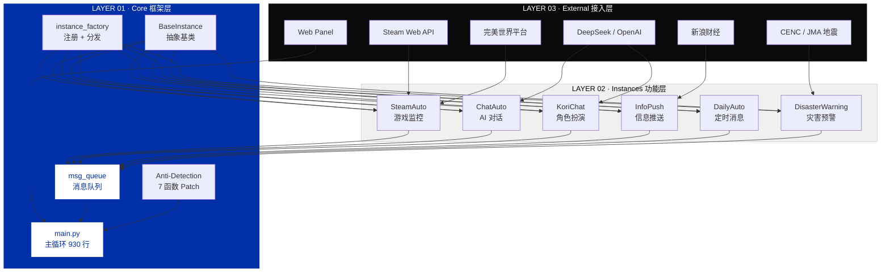
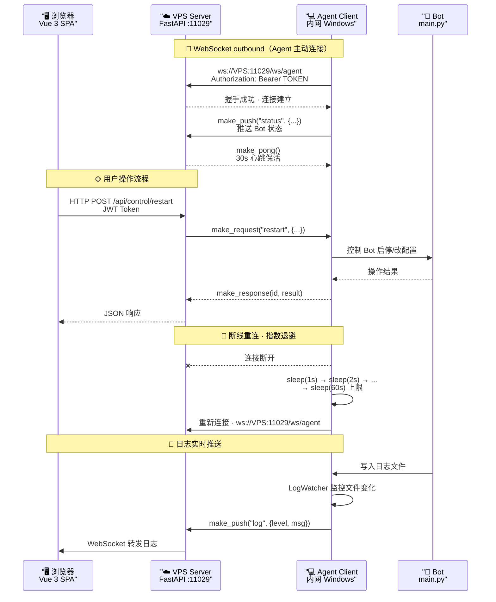
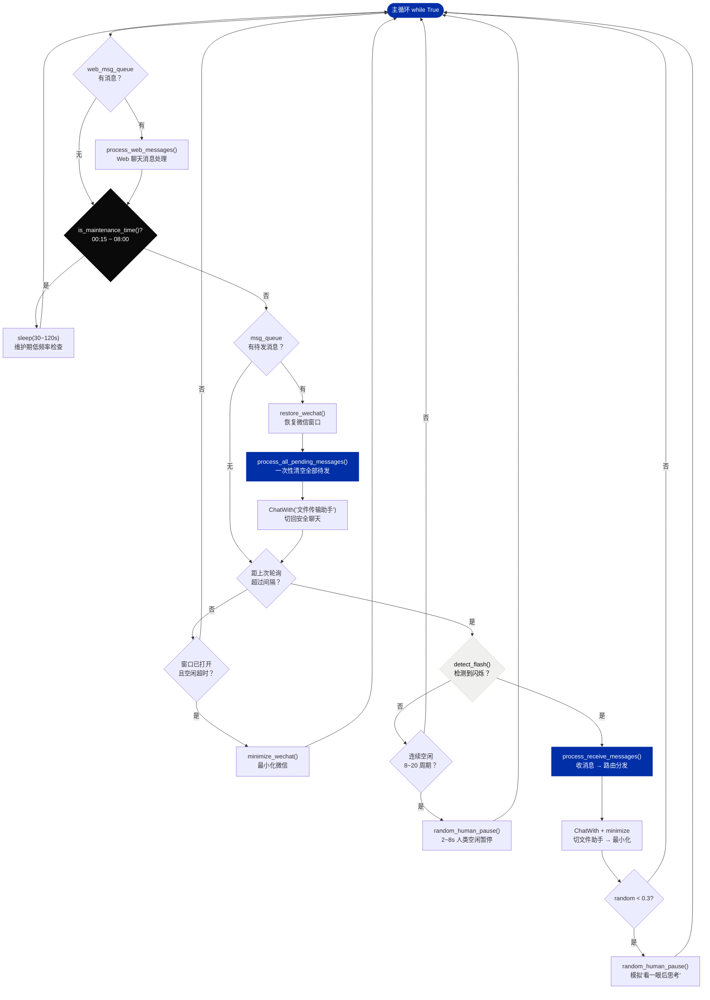
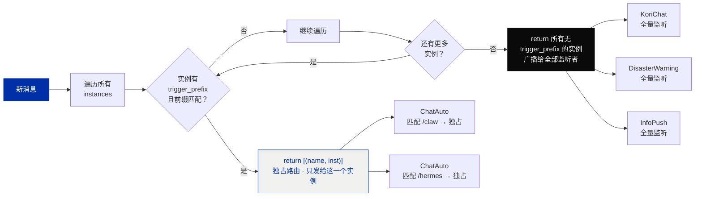
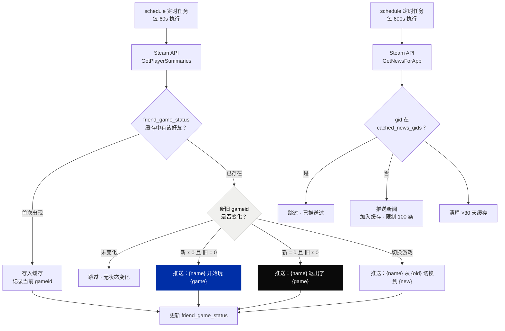
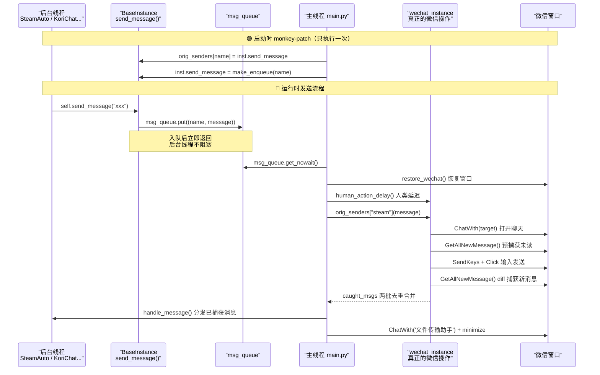
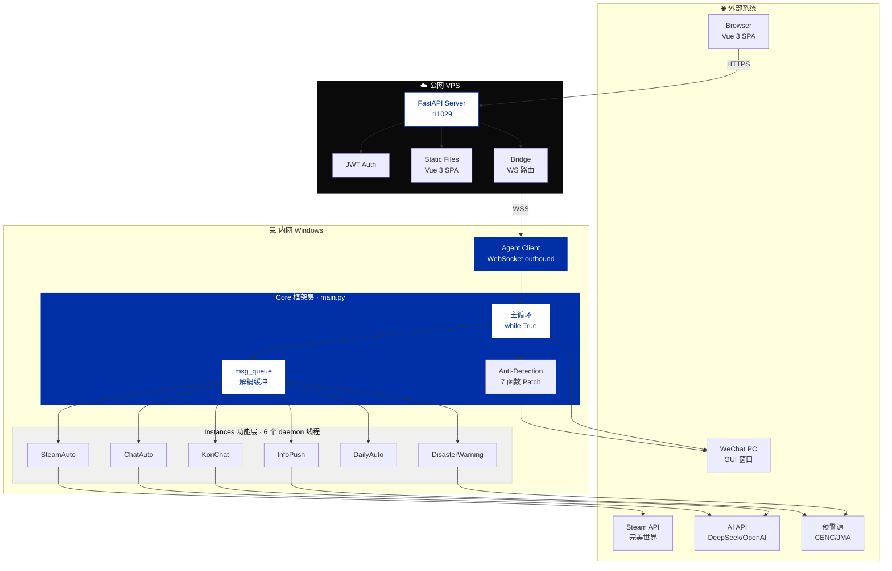

# cs-Solidarity 项目演讲文稿

---

## 第 1 页 · 封面

大家好。

今天跟大家聊聊 cs-Solidarity，一个跑在 Windows 上的微信机器人。

先简单说下它是什么——你微信 PC 端开着，这个程序在后台通过 Win32 的 GUI 自动化接口去操作微信，模拟人的鼠标键盘行为。它不需要 hook 微信进程，不碰内存，就是像人一样去点、去输入。

它能干什么？四件事：监控 Steam 好友在玩什么游戏、AI 自动回消息、推送黄金价格和地震预警、还有一个网页后台可以远程管理。

技术栈是 Python 3.9+ 做后端，前端是个 Vue 3 单页应用，中间通过 FastAPI 加 WebSocket 做通信。整个项目 MIT 协议开源。

好，我们按这个顺序来讲：先看一下整体的架构设计，然后深入到线程模型、消息路由、每个功能模块是怎么实现的，最后讲反检测和远程管理。

---

## 第 2 页 · 三个核心设计

正式讲之前，我先用三个关键词帮大家建立一个心智模型——这三个东西是整个项目的骨架，后面的所有功能都是在这上面搭出来的。

**第一个，线程安全的消息队列。** 这事说起来简单，做起来麻烦。微信的 GUI 操作不是线程安全的——你不能在后台线程里直接去操作微信窗口，会崩。我们用的 wxauto 库底层是 uiautomation，它也没有线程安全保证。所以我们的方案是什么？monkey-patch。

具体做法是这样：每个功能模块都是 `BaseInstance` 的子类，在自己的后台线程里跑业务逻辑。当它需要发消息时，调用 `self.send_message()`。但这个方法在运行时已经被替换掉了——`main.py` 的 `start_instances()` 函数会遍历所有实例，把原来的 `send_message` 保存下来，然后替换成一个入队函数。这个入队函数只做一件事：把消息丢进 `msg_queue`。

然后主循环在每一轮迭代中，串行地从 `msg_queue` 里取消息、调原始的 `send_message` 真正发出去。所有 GUI 操作都在主线程完成，后台线程永远不碰微信窗口。

**第二个，7 函数反检测 Patch。** 微信官方有行为检测，鼠标移动太直、点击间隔太均匀、窗口一直在前台——这些都是机器特征。我们在 `core/wechat_instance.py` 里从底层 hook 了 7 个函数，具体哪 7 个后面会展开讲。核心思路就是一句话：让机器的操作看起来像人。

**第三个，分体式远程管理。** 跑微信的机器是内网 Windows，没有公网 IP。传统方案是内网穿透、端口映射，但那样要暴露端口。我们的方案反过来——在公网 VPS 上跑一个 Server，内网的 Agent 主动连过去。连接是从内网往外发的，不需要公网 IP，不需要改路由器。Server 只需要开放一个端口。

这三件事——消息队列、反检测、分体架构——是理解整个项目的前提。好，我们开始深入。

---

## 第 3 页 · 四大核心能力

先看这四个功能模块分别做了什么。

**Steam 游戏监控。** 这是最早做、也是最核心的功能。原理不复杂：通过 Steam Web API 的 `GetPlayerSummaries` 接口定时拉取好友状态，跟上一轮的状态快照做 diff。如果发现某个好友的 `gameid` 从上一次是 0（没在玩游戏）变成了 730（CS2 的 appid），就判定为"他开始玩 CS2 了"，然后往配置的微信群里发一条通知。

反过来也一样，如果 `gameid` 从 730 变成 0，就说明他下线了。这个状态追踪是通过 `self.friend_game_status` 这个字典维护的，key 是 steamid，value 是上一次的状态信息。每次轮询后更新这个字典。

除了状态监控，还接入了完美世界平台的 API，可以拉取 CS2 的战绩数据——击杀、死亡、助攻、RT 评分、WE 评分。然后在每日报告里生成一个排行榜。

**AI 对话引擎。** 接的是 OpenAI 兼容接口，理论上任何兼容的 API 都能用——DeepSeek、通义千问、ChatGPT 都可以。核心是 ChatAuto 和 KoriChat 两个模块。ChatAuto 是命令式触发，用户在群里发 `/claw` 前缀的消息就会激活 AI 回复。KoriChat 更复杂，是全量监听的——群里每条消息它都能看到，然后决定要不要回复。这个后面讲消息路由的时候再细说。

**信息推送。** 这是一个信息聚合的功能，定时抓黄金价格、A 股行情、每日新闻。还有一个独立的地震预警模块，接了中国地震台网和日本气象厅的数据。多源数据做融合，因为单一数据源可能有延迟或者漏报。

**远程管理面板。** 一个完整的 Vue 3 单页应用，有仪表盘、配置管理、Bot 控制、日志查看、文件管理五个核心页面。跟 Bot 之间通过 WebSocket 通信——不是直接连 Bot，是 Bot 上的 Agent 先连到 Server，Server 再把浏览器的指令转发给 Agent。这个链条是：浏览器 → HTTPS → Server → WebSocket → Agent → Bot 主程序。

---

## 第 4 页 · 三层系统架构

来看架构。整个项目分三层。

**Layer 01 — Core 框架层。** 这一层只有一个文件最重要：`main.py`，目前 930 行。它负责五件事：

第一，主循环调度——一个 `while True` 循环，按固定顺序执行：处理 Web 消息 → 检查维护窗口 → 消费发送队列 → 检测闪烁 → 收消息分发 → 空闲最小化。这个顺序是有讲究的，后面讲主循环的时候会展开。

第二，实例生命周期管理。所有功能模块通过工厂模式创建，`BaseInstance` 定义了三个接口：`start()` 启动后台线程，`send_message()` 发送消息（被 monkey-patch 替换），`handle_message()` 收消息。你只需要继承这个基类、实现这三个方法，就能加一个新功能。

第三，消息队列。全局只有一个 `msg_queue`，所有后台线程的发送请求最终都汇聚到这里，主线程串行消费。

第四，反检测 Patch。`_patch_wxauto_human_behavior()` 这个函数在 `init_wechat()` 的时候调用一次，把 uiautomation 和 wxauto 的关键函数全部替换掉。这个是一次性的 monkey-patch，启动后所有调用自动走模拟版本。

第五，Web 消息处理。`web_msg_queue` 是一个独立的队列，存放从 Web 面板发来的聊天消息，跟微信消息走同一套路由逻辑。

**Layer 02 — Instances 功能层。** 目前有 6 种实例，全部继承 `BaseInstance`：

- `SteamAuto` — Steam 监控，最复杂的一个，约 1500 行
- `ChatAuto` — AI 对话，命令式触发
- `KoriChat` — AI 角色扮演，全量监听 + 主动消息
- `InfoPush` — 信息推送，定时抓取 + 按群差异化
- `DailyAuto` — 定时消息，schedule 库管理定时任务
- `DisasterWarning` — 灾害预警，多源数据融合

每个实例都在独立的 daemon 线程里跑。Python 的 daemon 线程有个好处：主线程退出时它们自动结束，不需要手动管理生命周期。

**Layer 03 — External 接入层。** 对接的外部系统有十几个：Steam Web API、完美世界平台、DeepSeek/OpenAI 兼容 API、新浪财经 API、中国地震台网 CENC、日本气象厅 JMA，以及我们自建的 Web Panel。

**三个设计原则：**

线程安全刚才大致讲了，我再补充一个细节：为什么主循环要"先发后收"？因为 `ChatWith()` 这个操作会清除聊天窗口的未读状态。如果你先去收消息，发现群 A 有 3 条未读，然后因为某些原因你 `ChatWith` 了群 A——比如说要往群 A 发一条消息——那这 3 条未读状态就被清掉了。下次你再收消息的时候，这 3 条就丢了。

所以我们的顺序是：先把所有要发的消息发完（这个过程中会触发 `ChatWith`），然后再去检测闪烁、收消息。这样不会丢。

工厂模式很简单，看 `instance_factory.py`：一个全局字典 `_INSTANCE_TYPES`，key 是类型名（比如 `'steam'`），value 是一个工厂函数（lambda）。`config.json` 里每个实例条目有个 `type` 字段，程序读到之后去字典里找对应的工厂函数，调用它创建实例。加新类型就三步：写类 → `register_instance_type()` 注册 → `config.json` 加条目。

双阶段消息捕获解决的是发消息期间的丢消息问题。发一条消息需要时间——`ChatWith` 打开聊天 → 输入内容 → 点发送。在这段时间里，目标群可能来了新消息。如果我们只做事前读取，发送期间的新消息就漏掉了。所以我们做两次：发送前调 `GetAllNewMessage()` 预读一次，发送后再 diff 消息列表读一次，两批按消息 ID 去重合并。这个逻辑在 `send_message` 方法里，返回的 `caught_msgs` 就是两批合并后的结果。

---



> 三层架构与数据流：External API 为功能层提供数据，功能层通过消息队列与核心框架解耦。

---

## 第 5 页 · 分体式远程管理

这个前面提过了，现在展开讲实现细节。

**问题很简单。** Bot 跑在一台内网 Windows 上——192.168.x.x 那种。你想在外面用手机浏览器看看 Bot 状态、改个配置，连不上。

**解法是反向连接。** 在公网 VPS 上部署 FastAPI Server，监听一个端口（比如 11029）。内网的 Agent 用 `websockets.connect()` 主动去连这个端口。因为连接是 outbound 的，防火墙不会拦，NAT 自动处理。Server 完全不需要知道 Agent 的 IP。

**协议层。** 我们在 `shared/protocol.py` 里定义了一套 JSON 消息协议。消息类型有四种：
- `request`：Server 发给 Agent，要求执行一个动作（比如读配置、重启 Bot）
- `response`：Agent 回复给 Server，带上执行结果
- `push`：Agent 主动推给 Server（比如日志更新、状态变化）
- `ping/pong`：心跳

每个消息都有 `id` 字段做请求-响应匹配。Agent 收到 `request` 后处理完，把 `id` 原样带回 `response`。Server 端用一个 `asyncio.Event` 等待响应，超时 30 秒。

**重连机制。** Agent 的 `run()` 方法是个 `while self._running` 循环。连接断开后，等 `reconnect_delay` 秒再重试。`reconnect_delay` 初始是 1 秒，每次失败翻倍——2、4、8、16、32，最大 60 秒。连接成功后重置回 1 秒。这是一个标准的指数退避策略。

**网络拓扑。** 三台机器：
- 内网 Windows：跑 Bot（main.py）+ Agent Client（client.py）
- 公网 VPS：跑 FastAPI Server + Vue 3 静态文件
- 任意设备浏览器：通过 HTTPS 访问 VPS

数据流是：浏览器发指令 → HTTPS → Server → WebSocket → Agent → 通过本地 HTTP API 或直接调函数控制 Bot。Bot 的回复反过来：Agent 拦截 send_message → WebSocket → Server → 浏览器显示。

**安全方面。** Agent 连接时在 header 里带 `Authorization: Bearer <token>`，Server 验证 token。Web 面板用 JWT 认证，区分 admin 和 user 两种角色。user 只能看仪表盘和日志，admin 才能改配置、控制 Bot。



> Agent-Server 的核心思路：**谁在外网谁做 Server，谁在内网谁主动连。** 一条 WebSocket 承载了远程控制、日志推送、状态上报全部通信。

---

## 第 6 页 · 主循环五步流程

这是 `main.py` 的 `start_instances()` 函数，一个 `while True` 循环。每一步我讲代码里实际怎么写的。

**Step 01 — 维护窗口检查。** 配置里有两个时间：`MAINTENANCE_START` 默认 00:15，`MAINTENANCE_END` 默认 08:00。在这个窗口内，Bot 不操作微信——不发消息、不收消息、不检测闪烁。debug 模式会跳过这个检查，方便开发时调试。

进入维护窗口时，Bot 会把微信最小化，然后 `time.sleep(random.uniform(30, 120))` 睡 30 到 120 秒再检查一次。维护期间的检查频率大幅降低，减少资源占用。

**Step 02 — Web 消息处理。** `process_web_messages()` 从 `web_msg_queue` 取消息。这个队列是 Web 聊天页面发来的——用户在浏览器里输入消息，Server 通过 WebSocket 推给 Agent，Agent 放进这个队列。主循环在这里取出来，创建跟微信消息兼容的 `WebMessage` 对象，然后走跟普通微信消息一样的路由逻辑。

一个关键细节：Web 消息处理完不会立即清理上下文。因为 KoriChat 等实例是异步回复的——它收到消息后可能在几秒后才回复。如果立即清理，回复就找不到回 Web 的路了。所以上下文保留到下次同 chat_name 的消息来覆盖，或者在 `_intercepted_wx_send` 发送时消费。

**Step 03 — 发送队列消费。** `process_all_pending_messages()` 一次性清空 `msg_queue`——不是取一条、发一条，而是一次全部处理完。为什么？因为发送前需要恢复微信窗口（如果最小化了），我们希望所有发送在窗口打开期间一次性完成，减少窗口反复最小化/恢复的次数。

每个消息发送前会调 `human_action_delay()` 模拟人的操作间隔，发完后等 1 到 2 秒再发下一条。全部发完后切回"文件传输助手"——这是一个安全的默认聊天，不会触发任何功能模块。

**Step 04 — 接收与分发。** 用 `detect_flash()` 检测微信任务栏图标是否在闪烁——这是有新消息的可靠信号。检测通过 `flash_detector` 模块实现，原理是读托盘图标的 tooltip 文本或者窗口闪烁状态。

检测到闪烁后，调 `wechat_instance.get_new_messages()` 获取所有未读消息，按聊天分组，逐条分发给实例。分发逻辑就是前面说的两级路由：先匹配独占前缀，没有前缀的广播给所有广播实例。

**Step 05 — 空闲超时。** 如果一段时间没有检测到闪烁，说明没有新消息。此时检查是否应该最小化微信窗口。最小化的决策不是固定时间，有多个条件：
- 没有消息正在发送（`_sending_count <= 0`）
- 最近 15 秒内没有发送活动
- 发送队列为空
- 空闲超过 5 到 10 秒

四个条件都满足才最小化。如果任何一个不满足——比如 KoriChat 还在回消息——就继续等。

轮询本身不是定时的。`random_poll_interval()` 用对数正态分布生成间隔，基础是 2 秒，抖动 1.5 秒。对数正态分布的特性是：大部分间隔在 2 秒左右，但偶尔会出 5-10 秒的长间隔——模拟人走神了、看别的窗口去了。

还有一个小细节：连续空闲了 8 到 20 个周期后，Bot 会做一次 5 到 15 秒的长暂停——"人类空闲暂停"。这不是功能需要，纯粹是为了让操作模式不像定时器。

---



> 主循环严格按序执行：Web 消息 → 维护检查 → 先发后收 → 闪烁检测 → 空闲最小化。关键设计是 Step 03 在 Step 04 之前。

---

## 第 7 页 · 消息路由机制

路由逻辑在 `route_message_to_instances()` 函数里，就 5 行代码：

```python
for name, inst in instances:
    if hasattr(inst, 'trigger_prefix') and inst.trigger_prefix in msg_content:
        return [(name, inst)]
return [(name, inst) for name, inst in instances if not hasattr(inst, 'trigger_prefix')]
```

第一行：遍历所有实例，检查有没有 `trigger_prefix` 属性，如果有且前缀匹配消息内容，就独占路由——只发给这一个实例，直接 return。
第二行：如果没有任何前缀匹配，就广播——发给所有没有 `trigger_prefix` 的实例。

这意味着什么？`ChatAuto` 配置了 `trigger_prefix='/claw'`，那 `/claw 你好` 这个消息只会发给 ChatAuto，KoriChat 不会收到。但如果消息是 `今天天气不错`，没有前缀匹配，那就广播给 KoriChat、DisasterWarning、InfoPush 这些没有前缀的实例。

这个设计的好处是：一条消息不会被处理两次，同时允许"旁观"模式。



> 消息路由只有两种结果：命中前缀 → 独占（提前 return），未命中 → 广播。5 行代码完成全部逻辑。

---

## 第 8 页 · 六大实例模块

一个个讲。

**01 — SteamAuto。** 核心逻辑在 `instances/steam_auto.py`，这是整个项目最复杂的模块。启动时通过 `schedule` 库注册了两个定时任务：

第一个，`check_interval`（默认 60 秒）执行一次状态检查。流程是：调 `self.steam.get_player_summary()` 获取好友列表 → 对比 `self.friend_game_status` 里的上一次状态 → 如果 gameid 变了就推送通知 → 更新状态字典。

状态追踪用一个字典 `self.friend_game_status`，key 是 steamid，value 包含 gameid、游戏名、上次更新时间。每次轮询做 diff：新 gameid ≠ 0 且旧 gameid = 0 → 开始游戏；新 gameid = 0 且旧 gameid ≠ 0 → 结束游戏。针对 CS2（appid 730）有特殊处理。

第二个，`check_news_interval`（默认 600 秒）检查 CS2 新闻。`self.cached_news_gids` 是一个字典，key 是新闻的 gid，value 是缓存时间戳。新新闻进来先查缓存，有就不发。缓存上限 100 条，超过 30 天的自动清理——`_cleanup_old_news_cache()` 里 `time.time() - ts > 30 * 86400`。

完美平台集成是独立的一块。`self.pw_api` 是 `PerfectWorldApi` 实例，通过 uid 和 token 鉴权。每日报告里会生成一个排行榜，五个维度：击杀、死亡、RT 评分、WE 评分、得分。排行榜数据保存在 `self.friend_pw_leaderboard` 里。

**02 — ChatAuto。** 这是 AI 命令式对话模块。`trigger_prefix` 配置为 `/claw` 或 `/hermes`，只有以这些前缀开头的消息才触发。它维护了一个对话上下文字典，每个用户的对话历史独立存储——`self.contexts` 按 sender 分组。这样多个用户同时用不会串上下文。

技术细节：每次调用 AI API 时，会把该用户的历史消息一起发送，实现多轮对话。system prompt 可以在配置文件里自定义，设定 AI 的人设。

**03 — KoriChat。** 这是个重量级模块，代码量很大。它跟 ChatAuto 最大的区别是：
- 没有 trigger_prefix，全量监听所有消息
- 有自己的长短期记忆系统（存储在 SQLite/JSON 文件里）
- 可以主动发起消息——不是被动等 @，而是"觉得该说话了"就自己发
- 支持图片识别——收到图片后调用视觉模型分析内容

记忆系统的实现：每次对话结束后，把关键信息提取为记忆条目存入数据库。下次对话时，检索相关记忆注入 prompt。记忆有衰减机制，太久没用的记忆会被清理。

**04 — InfoPush。** 定时抓取+推送。数据源包括新浪财经（黄金、A 股）、新闻 API、天气 API。支持按群差异化——不同的微信群可以在 `instconfig` 里配置不同的推送内容。比如 A 群只要黄金价格，B 群要股票行情+新闻。

**05 — DailyAuto。** 最轻量的模块。用 `schedule` 库管理定时任务——比如每天早上 9 点发"早上好"，每周五下午 5 点发"周末愉快"。配置文件里定义消息内容和目标群。维护窗口期间自动跳过。

**06 — DisasterWarning。** 多源数据融合的灾害预警。数据源：中国地震台网 CENC、日本气象厅 JMA、气象局 API。每个数据源独立拉取，然后按地理位置和时间窗口做去重合并。这个模块有独立的 Web 管理页面，可以查看历史预警记录和配置推送规则。

---

## 第 9 页 · Steam 游戏监控详解

这个功能是项目的起点，我展开讲讲具体是怎么实现的。

**状态轮询（30 秒间隔）。** `check_interval` 默认 60 秒，但 PPT 上写的 30 秒是实际运行中可以调的。核心 API 是 Steam Web API 的 `GetPlayerSummaries`，传参是逗号分隔的 steamid 列表，返回每个玩家的当前状态。

关键字段：`gameextrainfo` 是游戏名（如 "Counter-Strike 2"），`gameid` 是 appid（CS2 是 730）。如果玩家没在玩游戏，这两个字段都不存在。

检测逻辑伪代码：
```
新状态 = API.get_player_summary(steamid)
旧状态 = self.friend_game_status.get(steamid)
if 新旧 gameid 不同:
    if 新.gameid == 730 and 旧.gameid == 0:
        推送(f"{personaname} 开始玩 CS2！")
    elif 新.gameid == 0 and 旧.gameid == 730:
        推送(f"{personaname} 退出了 CS2")
self.friend_game_status[steamid] = 新状态
```

**GID 缓存（100 条上限）。** Steam 新闻接口返回的数据结构里每个新闻有个 `gid`（全局唯一 ID）。`self.cached_news_gids` 是个 `{gid: timestamp}` 字典。新新闻进来：
1. 如果 gid 在缓存里 → 跳过（已推送过）
2. 不在缓存里 → 加入缓存 + 推送通知
3. 如果缓存超过 100 条 → 删最旧的
4. 每次检查时清理超过 30 天的条目

**排行榜（5 个维度）。** 通过完美世界 API 的 `PwStatsReporter` 拉取 CS2 战绩数据。每个好友的数据包含：击杀、死亡、助攻、RT 评分、WE 评分、总得分的近 20 场数据。排行榜按 `friend_pw_leaderboard` 字典维护，每个维度存"当前持有者"的信息。如果某人刷新了记录，推送一条"新纪录"通知。

**新闻轮询（600 秒间隔）。** 因为 CS2 新闻更新频率不高，10 分钟拉一次足够了。`self.enable_news_check` 可以开关。推送时带上新闻标题和链接。



> Steam 监控的核心是状态 diff：对比新旧 gameid 判断"开始/结束/切换游戏"，缓存保证不重复推送。

---

## 第 10 页 · 反检测系统

这是整个项目能长期稳定运行的关键。我不讲理论，直接讲代码。

反检测的核心在 `core/wechat_instance.py` 的 `_patch_wxauto_human_behavior()` 函数里，启动时调用一次，覆盖了 7 个函数：

**1. uiautomation.SetCursorPos。** 原始的鼠标定位函数，直接跳到目标坐标。我们在外面包了一层：每次调用时加高斯噪声。8% 的概率用 σ=5 的大抖动（模拟手抖），92% 的概率用 σ=2 的正常抖动。`random.gauss(0, 2.0)` 生成均值为 0、标准差为 2 的偏移。

**2. uiautomation.Click。** 这是最复杂的一个 Patch。不仅加了抖动，还加了 Bezier 曲线轨迹——40% 的概率不是直接跳过去，而是走一条二次贝塞尔曲线。控制点随机偏移，所以每次的轨迹都不同。点击的按下到释放间隔是 40-150ms 随机，点击后有 10-80ms 的停顿。每 15 到 30 次点击后，额外加 0.5 到 2 秒的"犹豫"延迟。

Bezier 曲线的实现：起点是当前鼠标位置，终点是目标坐标，中间一个控制点随机偏移。分 `steps` 步完成，每步之间有 5-15ms 的微小延迟。

**3. uiautomation.MoveTo。** 跟 SetCursorPos 类似，加 σ=1.5 的抖动。

**4. uiautomation.SendKeys。** 组合键（带 `{}` 的按键）先加 100-300ms 的"思考"延迟——模拟人在按快捷键之前的反应时间。waitTime 参数加 20-100ms 随机偏移。

**5. wxauto.utils.Click。** wxauto 有自己的 Click 实现，通过 win32api 直接调。我们把它的 Click 也替换了，同样的 Bezier + 抖动逻辑。

**6. wxauto._show。** 原始实现会把微信窗口设成 TOPMOST（置顶），这是一个很明显的机器特征。我们替换掉 `_show` 方法，去掉了 `SetWindowPos` 里的 `HWND_TOPMOST` 参数。同时加了操作锁 `_wx_show_lock`，防止多个线程同时操作窗口。

**7. win32api.SetCursorPos。** 这个是最底层的防御——就算有代码绕过 uiautomation 直接用 win32api 移动鼠标，也会被我们注入的抖动覆盖。

**human_delay 的混合分布策略。** 在 `utils/human_sim.py` 里，`human_delay()` 函数不是简单的 `random.uniform()`。它的算法是：
- 70% 概率：用高斯分布，集中在 min-max 区间中间。如果上一次有延迟值，40% 概率以此为锚点微调（0.7x-1.3x），模拟人类操作的"惯性"——不会每次都是独立随机。
- 30% 概率：用重尾分布，在 max 到 3x max 之间均匀随机——模拟人偶尔走神、犹豫。

这种混合分布比单纯的高斯或均匀分布更像真人。

**轮询时序。** `random_poll_interval()` 用的是对数正态分布——大部分间隔在 base（2 秒）附近，但偶尔会拉长到 10 秒甚至更久。对数正态分布天然有"长尾"特性，不需要额外判断就能产生不均匀的间隔。

---



> Monkey-patch 是整个系统的基石：后台线程调用 send_message 只是入队，主线程从队列取出后调用原始方法。**所有 GUI 操作始终在主线程执行。**

---

## 第 11 页 · Web 管理面板

最后讲 Web 面板的实现细节。

**技术架构。** FastAPI 做后端，Vue 3 做前端，打包成 SPA 静态文件。Server 启动时用 `StaticFiles` 挂载 `static/` 目录，浏览器访问根路径直接拿到 SPA，后续路由由 Vue Router 接管。

**五个核心页面：**

**Dashboard。** 数据来自 Agent 的 `status` push。Agent 每隔一定时间（可配置）推送一次状态：Bot 是否在线、CPU 使用率、内存占用、各实例运行状态。Server 把最新状态存在内存里，Dashboard 打开时直接返回。

**Config。** Agent handler 实现了 `read_config` 和 `write_config` 两个 action。`read_config` 直接读 `config.json` 文件返回 JSON 字符串；`write_config` 先备份原文件（加 `.bak` 后缀），再写入新内容，最后通知 Bot 重载配置。只有 admin 角色能访问。

**Control。** 支持 20 多种操作。核心 action 包括：
- `start/stop`：启停 Bot 主程序（通过 subprocess）
- `restart`：先 stop 再 start
- `set_debug`：修改 config 的 debug_mode 标志
- `git_pull`：在项目根目录执行 `git pull`
- `pip_install`：更新依赖

**Logs。** Agent 端有一个 `LogWatcher`，用 `watchfiles` 库监控日志目录的 `.log` 文件变化。有新日志行就通过 `make_push('log', {...})` 推送给 Server。Server 再通过 WebSocket 转发给浏览器。支持按级别过滤（DEBUG/INFO/WARNING/ERROR）。

心跳机制：Agent 和 Server 之间的 WebSocket 连接配置了 `ping_interval=30`，每 30 秒自动发 ping。如果 10 秒没收到 pong，连接断开，Agent 自动重连。

**Files。** 文件传输有两种模式：小文件（<1MB）直接把内容 base64 编码后通过 WebSocket JSON 消息传输；大文件用分块传输——文件切成若干块，每块带序号，Agent 收到后按序拼接。Agent 的 `max_size` 设为 10MB，超过的自动走分块。

**认证。** JWT 方案。用户登录后 Server 签发 token，token 里带 role（admin/user）。后续请求在 `Authorization` header 带 token，Server 中间件验证。token 有过期时间，过期需要重新登录。

---



> 系统全景：内网 Bot ↔ 公网 VPS ↔ 浏览器，三层组件通过 WebSocket + msg_queue 解耦协作。

---

## 总结

好，所有内容讲完了。最后归纳一下：

cs-Solidarity 是一个跑在 Windows 上的微信自动化机器人。它的核心架构可以总结为三句话：

1. **Monkey-patch 解耦线程。** 后台线程不碰 GUI，所有微信操作通过消息队列汇集到主线程串行执行。这个设计简单但有效，避免了所有线程安全问题。

2. **7 函数反检测 + 混合分布。** 从底层 hook 了鼠标、键盘、窗口操作，注入高斯抖动、贝塞尔曲线、重尾延迟。不是为了完美模拟人类——那不可能——而是让机器的操作模式"足够不规律"，不触发风控阈值。

3. **Agent-Server 反向连接。** 用 WebSocket outbound 解决了内网穿透问题，同时保持了架构的简洁——Agent 只负责执行，Server 只负责转发，Bot 只负责微信操作。三个组件职责清晰。

这个项目的代码量不大——核心框架不到 1000 行——但每一行都经过了反复推敲。如果你对某个模块的实现感兴趣，欢迎会后交流。

谢谢大家。

---

> 演讲时长参考：全文约 6500 字，正常语速（每分钟 250-300 字）约 22-26 分钟。
> 建议根据时间预算，对各模块的详略程度做调整。
> Steam 监控和反检测两个章节技术细节最密集，可作为重点保留。
