# cs-Solidarity Web 控制面板

## 项目简介

cs-Solidarity Web 控制面板是一个基于 WebSocket 的远程管理工具，用于管理运行在内网 Windows 机器上的微信机器人。采用 Agent-Server 架构，用户通过浏览器访问公网服务器，服务器通过 Agent 远程操作内网机器。

> 📘 运维操作（启动/关闭/清理）详见 [OPS.md](./OPS.md)

## 快速开始

### 环境要求
- Python 3.9+
- 网络：Agent 所在机器能主动访问 Web Server 的 WebSocket 端口

### 安装

#### B 机器（公网服务器）
```bash
# 安装依赖
pip install -r web/requirements.txt

# 启动服务
cd web
uvicorn server:app --host 0.0.0.0 --port 11029

# 首次运行会生成 admin 密码，请记录！
# 之后访问 http://your-server:11029
```

#### A 机器（内网 Windows）
```bash
# 安装依赖
pip install -r agent/requirements.txt

# 启动 Agent
python -m agent.client --server ws://B_IP:11029/ws/agent --token your-agent-token --root D:\code\cs-Solidarity
```

### 修改 admin 密码
首次登录后，建议立即修改密码：
1. 登录 Web 面板
2. 点击右上角用户名 → 修改密码

## 架构说明

```
内网 Windows (A)                    公网服务器 (B)
┌─────────────────┐                ┌──────────────────┐
│  Bot (main.py)  │                │  Web Server      │
│  Agent          │──── WebSocket ────│  (FastAPI)       │
│  Config/Logs    │    (A→B)       │  Frontend (Vue3)  │
└─────────────────┘                └──────────────────┘
                                            ↑
                                       用户浏览器
```

- **Agent**：轻量 WebSocket 客户端，主动连接服务器，处理文件读写和进程控制
- **Server**：FastAPI 应用，提供 REST API 和 WebSocket 端点
- **Frontend**：Vue 3 单页应用，深色主题，响应式布局

## 功能概览

| 功能 | admin | user |
|------|-------|------|
| 仪表盘（状态/实例/日志） | ✅ | ✅ |
| 实例管理（查看详情） | ✅ | ✅ |
| 配置编辑（JSON编辑器） | ✅ | ❌ |
| Steam 数据（好友/排行榜/时间轴） | ✅ | ✅ |
| 聊天页面（转发到 Bot 实例） | ✅ | ✅ |
| 文件管理（Web/Agent 存储模式） | ✅ | ✅（只能删除自己上传的文件） |
| 日志查看（筛选/搜索） | ✅ | ✅ |
| 控制（启动/停止/重启 Bot） | ✅ | ❌ |
| 用户管理（注册审核/创建/删除/改角色） | ✅ | ❌ |

## 界面预览

| 登录 | 仪表盘 | Steam 数据 |
|------|--------|------------|
| 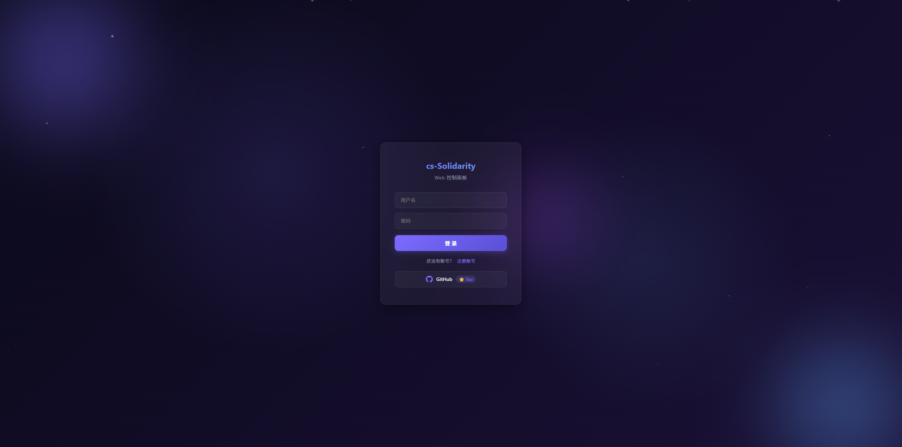 | 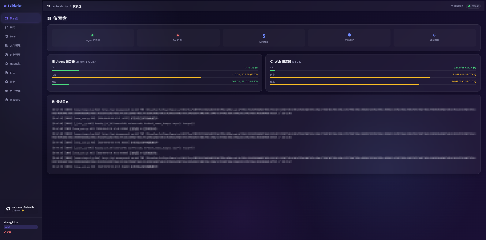 | 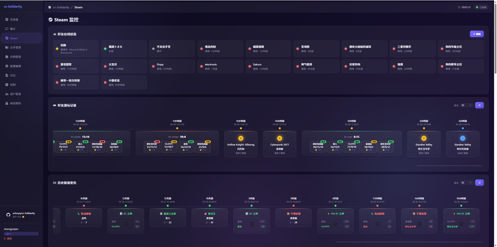 |
| Steam 时间轴 | Steam 排行榜 | 聊天 |
| 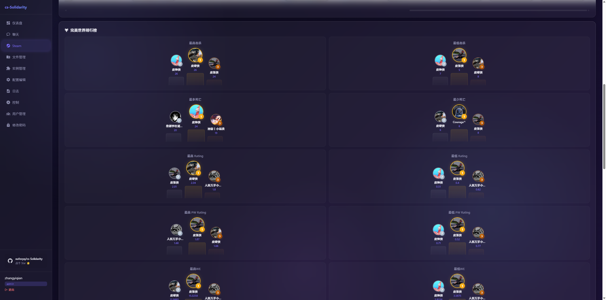 | 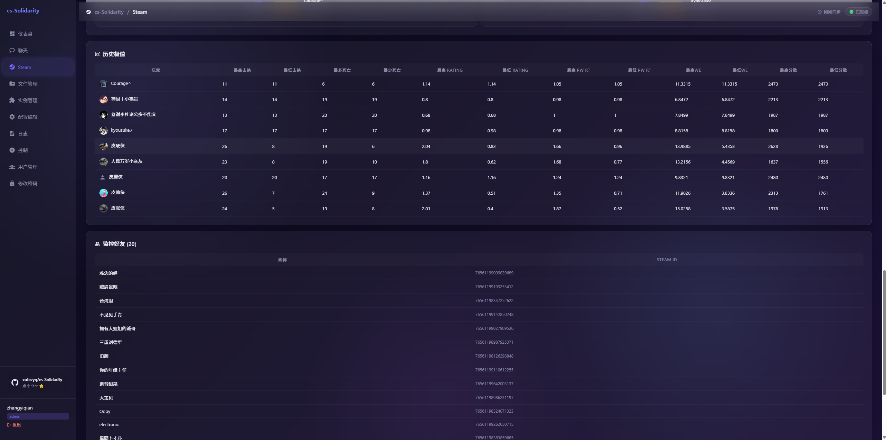 | 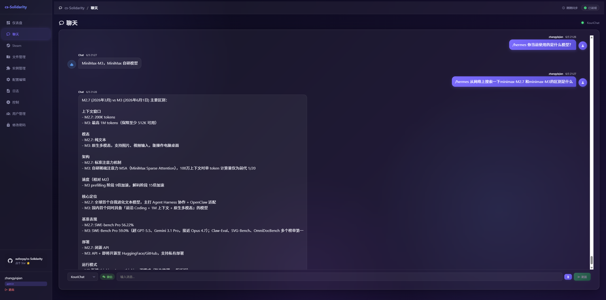 |
| 实例管理 | 文件管理 | 配置编辑 |
| 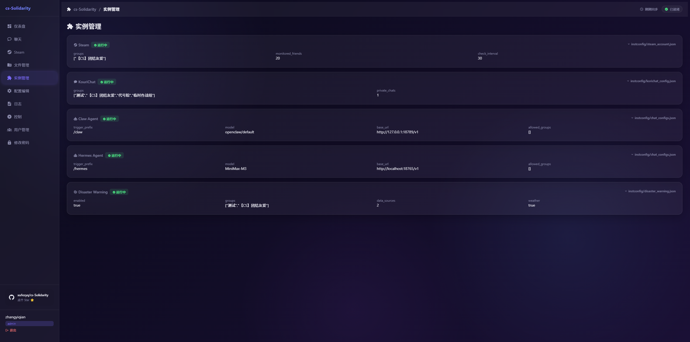 | 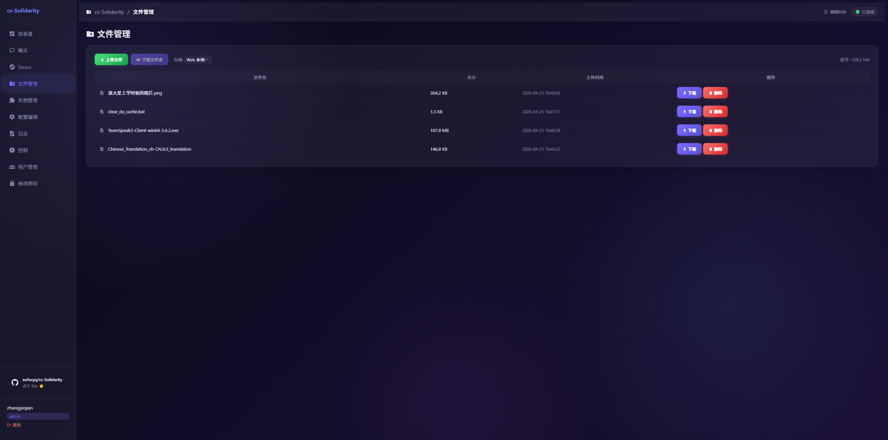 | 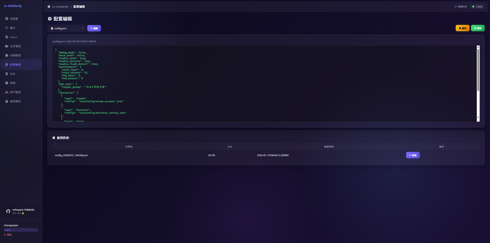 |
| 日志 | 控制 | 用户管理 |
| 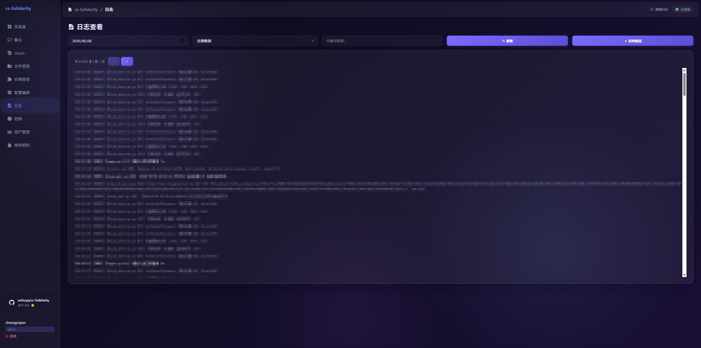 | 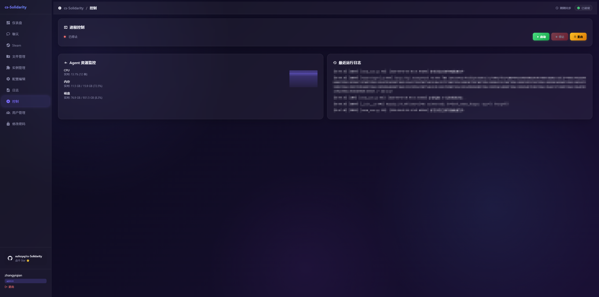 | 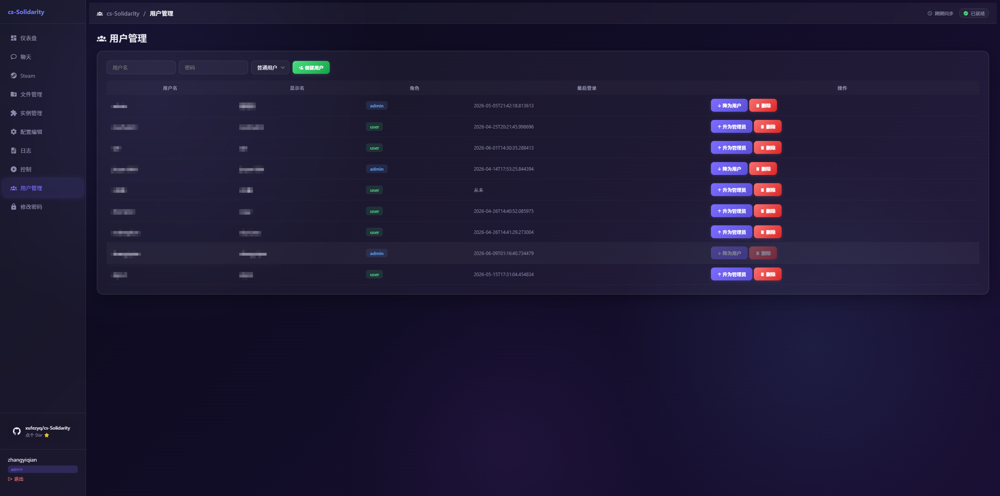 |
| 修改密码 |  |  |
| 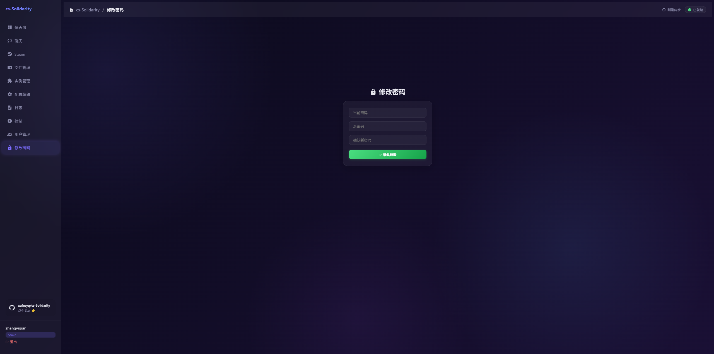 |  |  |

## API 文档

启动服务后访问 `http://server:11029/docs` 查看 Swagger API 文档。

详细接口定义见 [REQUIREMENTS.md](./REQUIREMENTS.md) 第 5 节。

## 配置说明

### Agent 配置
- `--server`：WebSocket 服务器地址（如 `ws://1.2.3.4:11029/ws/agent`）
- `--token`：Agent 连接令牌
- `--root`：cs-Solidarity 项目根目录（默认当前目录）

### Server 配置
- 首次运行自动生成 `users.json`
- Agent 连接令牌在启动时生成并输出到控制台
- `uvicorn server:app --port 11029` 是当前部署示例端口
- `python -m web.server` 未指定参数时默认监听 `127.0.0.1:8080`，可通过 `--host`、`--port`、`--token` 修改
- `web/web_config.json` 中的 `file_storage_mode` 控制文件存储在 Web 端还是 Agent 端

### 安全建议
- 生产环境使用 Nginx + HTTPS
- 定期修改密码
- 限制 Agent 连接的 IP 白名单（防火墙规则）
- 定期备份 `users.json`

## 常见问题

### Q: Agent 连接不上服务器？
- 检查 B 机器防火墙是否开放了 WebSocket 端口
- 确认 Agent 的 `--server` 地址正确（ws:// 不是 http://）
- 确认 token 正确

### Q: 忘记 admin 密码？
- 删除 `web/users.json`
- 重启 Web Server，会重新生成 admin 账户和新密码

### Q: Agent 断线后会怎样？
- Agent 会自动重连（指数退避，最长 60 秒）
- Web 前端会显示"Agent 未连接"状态
- 配置编辑和控制功能不可用

### Q: 聊天页面和微信同步有什么区别？
- “微信”模式会把 Web 用户消息加前缀后同步到配置的微信群/好友，并把实例回复返回网页
- “仅网页”模式只在网页中显示实例回复，不实际发送到微信
- 聊天上传文件会强制走 Agent 存储，方便 OpenClaw 等同机工具读取

### Q: 如何查看实时日志？
- 在 Web 面板的"日志"页面，新日志会通过 WebSocket 实时推送显示
- 也可以选择日期查看历史日志

### Q: 支持多个 Agent 同时连接吗？
- 当前版本只支持一个 Agent 连接
- 后续版本可能支持多 Agent 管理多台机器
